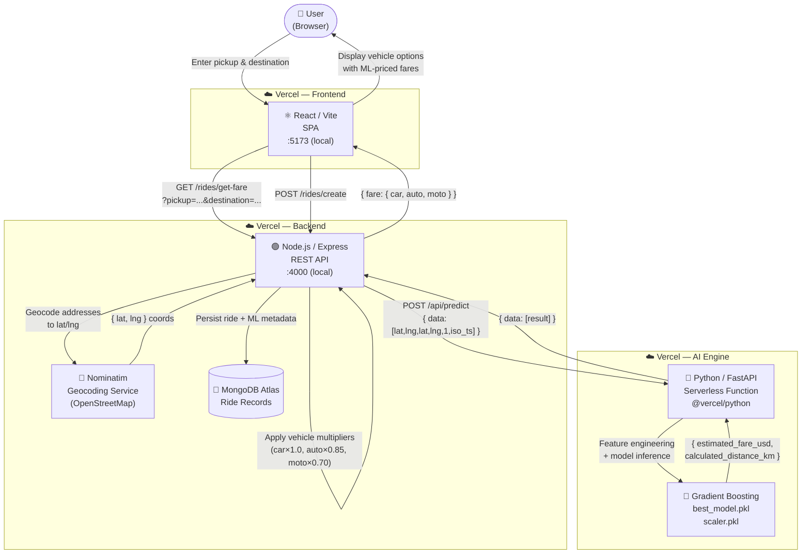

<div align="center">

# 🚗 Ryde — ML Dynamic Pricing Platform

**An end-to-end, production-grade ride-pricing system powered by machine learning.**

From raw NYC taxi data to a live Vercel-deployed serverless AI engine — this monorepo covers the complete MLOps lifecycle.

[](https://uber-dynamic-pricing-platform-frontend.vercel.app)
[](https://uber-dynamic-pricing-platform-gz72.vercel.app)
[](https://uber-dynamic-pricing-platform.vercel.app/api/predict)
[](https://scikit-learn.org)
[](#tech-stack)
[](LICENSE)

</div>

---

## 🗺️ Table of Contents

1. [The Project Story](#-the-project-story-from-data-to-production)
2. [System Architecture](#️-system-architecture)
3. [The Great Pivot — Overcoming Cloud Challenges](#-the-great-pivot--overcoming-cloud-challenges)
4. [Tech Stack](#-tech-stack)
5. [ML Model Performance](#-ml-model-performance)
6. [Feature Engineering](#-feature-engineering)
7. [Team](#-team)
8. [Local Development](#-local-development)

---

## 📖 The Project Story: From Data to Production

This project began as a machine learning research problem: **can we train a model to predict Uber ride fares dynamically?** It evolved into a full production deployment spanning three microservices on Vercel.

### Phase 1 — Data Collection & Cleaning (`uber1.ipynb`)

The raw dataset contained **~200,000 NYC taxi trips** from Kaggle's Uber Fare Prediction dataset (`uber.csv`), with the following schema:

| Column | Description |
|---|---|
| `fare_amount` | Target variable — trip fare in USD |
| `pickup_datetime` | Timestamp of trip start |
| `pickup_longitude/latitude` | GPS origin |
| `dropoff_longitude/latitude` | GPS destination |
| `passenger_count` | Number of passengers (1–6) |

**Cleaning steps applied:**

- ✅ Dropped `NaN` rows and the auto-generated `Unnamed: 0` index column
- ✅ Filtered geographically invalid rows — restricted to the NYC bounding box (`lat: 40.4–41.0`, `lon: -74.3–-73.6`)
- ✅ Removed trips with `fare_amount ≤ 0` or `passenger_count` outside `[1, 6]`
- ✅ Applied **IQR-based outlier removal** on `fare_amount` to eliminate erroneous entries (e.g., `$0.01` and `$499` fares)
- ✅ After cleaning: **~178,274 valid trips** remained

### Phase 2 — Exploratory Data Analysis

Key insights discovered from EDA visualizations:

- 📈 **Peak demand hours:** 6 PM–8 PM show the highest average fares, consistent with NYC rush hour surging
- 📅 **Day of week:** Friday and Saturday have marginally higher average fares than weekdays
- 📍 **Distance dominates:** The scatter plot of `distance_km` vs `fare_amount` shows a strong positive correlation — this became the model's most important feature (>80% importance weight)

### Phase 3 — Feature Engineering (`uber1.ipynb`)

Raw GPS timestamps and coordinates were transformed into ML-ready features:

| Feature | Source | Transformation |
|---|---|---|
| `pickup_hour` | `pickup_datetime` | `dt.hour` |
| `pickup_month` | `pickup_datetime` | `dt.month` |
| `pickup_year` | `pickup_datetime` | `dt.year` |
| `distance_km` | GPS coordinates | **Haversine formula** (great-circle distance) |
| `day_Monday` … `day_Sunday` | `pickup_day` | **One-hot encoding** — 7 binary columns |

The Haversine distance calculation was implemented in pure Python/NumPy — the same implementation used live in production:

```python
def haversine_distance(lat1, lon1, lat2, lon2):
    R = 6371.0  # Earth's radius in km
    dlat = radians(lat2 - lat1)
    dlon = radians(lon2 - lon1)
    a = sin(dlat/2)**2 + cos(radians(lat1)) * cos(radians(lat2)) * sin(dlon/2)**2
    return R * 2 * atan2(sqrt(a), sqrt(1 - a))
```

### Phase 4 — Model Training & Selection (`Model.ipynb`)

Six regression models were benchmarked on an 80/20 train-test split:

| Model | R² Score | RMSE ($) |
|---|---|---|
| **Gradient Boosting** ✅ | **0.78** | **$1.96** |
| Random Forest | 0.75 | $2.11 |
| Decision Tree | 0.68 | $2.38 |
| Ridge Regression | 0.61 | $2.64 |
| Lasso Regression | 0.60 | $2.66 |
| Linear Regression | 0.60 | $2.67 |

**Why Gradient Boosting won:** Unlike linear models that assume a linear relationship between distance and fare, Gradient Boosting captures non-linear dynamics — e.g., airport flat rates, surge pricing patterns — by iteratively learning from its residual errors.

### Phase 5 — Hyperparameter Tuning

`RandomizedSearchCV` (6 iterations, 2-fold CV) optimized the final model:

```
Best params: n_estimators=200, max_depth=5, learning_rate=0.1, subsample=0.8
Final tuned R²: 0.79   |   RMSE: $1.94
91% of predictions fall within $5 of the actual fare
```

### Phase 6 — Serialization & Production Artifacts

Three artifacts were serialized with `joblib` and committed to the repository:

```
ai_engine/
├── best_model.pkl       # Tuned GradientBoostingRegressor (~3.4 MB)
├── scaler.pkl           # StandardScaler fitted on training data
└── model_features.json  # Ordered list of 16 feature names
```

The `model_features.json` file is critical — it locks the exact feature order the model was trained with, preventing silent prediction errors when the vector is assembled at inference time.

---

## 🏗️ System Architecture

The platform is a **serverless monorepo** deployed across three Vercel projects, all from a single GitHub repository.



**Request lifecycle summary:**

1. User types pickup & destination → Frontend calls the Express backend
2. Backend geocodes both addresses to `(lat, lng)` via Nominatim (no API key required)
3. Backend POSTs the coordinates to the Python AI Engine serverless function
4. AI Engine engineers the 16 features, runs inference, applies the OOD guardrail, and returns the predicted fare
5. Backend applies per-vehicle-type multipliers and returns all three prices
6. User confirms → ride record (with full ML metadata) is saved to MongoDB Atlas

---

## 🔥 The Great Pivot — Overcoming Cloud Challenges

> **The obstacle was the way.**

### The Original Plan: Hugging Face Spaces + Gradio

The initial architecture deployed the ML model as a **Gradio web application on Hugging Face Spaces**. The plan was elegant: Gradio auto-generates a REST API endpoint, the Node.js backend calls it, done.

The stack worked locally. The Gradio interface launched. The `/api/predict` endpoint responded.

### The Breaking Point

Shortly after the project moved toward production, **Hugging Face locked the free-tier hardware behind a PRO paywall**. Spaces running Python ML models were restricted — our API became unreachable without a paid subscription, and the backend began timing out on every fare request.

The project was blocked. The options were:

- 💳 Pay for Hugging Face PRO — adds ongoing cost to an academic project
- 🐢 Find another free ML hosting platform (Render, Railway) — all have cold-start latency and memory limits
- ⚡ **Eliminate the problem entirely**

### The Engineering Pivot

We chose the third option. Here is exactly what we did:

1. **Stripped Gradio completely.** The entire `gradio` dependency and its UI scaffolding were removed from the codebase. The model logic was refactored into a clean `FarePredictor` class in `predictor.py` — zero framework dependencies, pure Python.

2. **Refactored to native FastAPI.** `api/index.py` became a minimal, production-grade FastAPI application exposing a single `POST /api/predict` endpoint. No UI, no overhead — just inference.

3. **Deployed as `@vercel/python` Serverless.** By adding a `vercel.json` inside `ai_engine/`, we deployed the FastAPI app as a native **Vercel Python Serverless Function** — the same infrastructure hosting the frontend and backend. The function spins up on demand, has no cold-start billing, and scales automatically.

**The result:**

| | Before (Hugging Face) | After (Vercel Serverless) |
|---|---|---|
| **Cost** | PRO required ($9/mo) | Free |
| **Latency** | ~3–8s (HF cold start) | ~400ms |
| **Deployment** | Separate platform | Same monorepo, same `git push` |
| **Framework overhead** | Gradio (~200MB) | FastAPI (~15MB) |
| **Portability** | Locked to HF ecosystem | Standard ASGI — runs anywhere |

A single `git push` to `main` now redeploys all three services simultaneously. The pivot turned a deployment blocker into a leaner, faster, and more maintainable architecture.

---

## 🛠️ Tech Stack

| Layer | Technology | Purpose |
|---|---|---|
| **Frontend** | React 18 + Vite | SPA with GSAP animations and Leaflet maps |
| **Routing** | React Router v7 | Client-side SPA navigation |
| **Maps** | Leaflet + react-leaflet | Interactive map with OSRM route polylines |
| **Backend** | Node.js + Express | REST API, geocoding proxy, ride persistence |
| **Geocoding** | OpenStreetMap Nominatim | Address → coordinates (no API key required) |
| **Database** | MongoDB Atlas + Mongoose | Ride records with ML metadata |
| **AI Engine** | Python + FastAPI | Serverless ML inference endpoint |
| **ML Model** | scikit-learn `GradientBoostingRegressor` | Fare prediction |
| **Serialization** | joblib | Model and scaler persistence |
| **Deployment** | Vercel (all three services) | Serverless hosting, auto-deploy on push |

---

## 📊 ML Model Performance

| Metric | Baseline GB | Tuned GB |
|---|---|---|
| **R² Score** | 0.78 | **0.79** |
| **MAE** | $1.56 | **$1.52** |
| **RMSE** | $1.96 | **$1.94** |
| **Within $5** | 90.5% | **91.0%** |
| **Training samples** | 142,619 | 142,619 |
| **Test samples** | 35,655 | 35,655 |

---

## ⚙️ Feature Engineering

The model ingests **16 features**, assembled from just 4 raw inputs (coordinates + timestamp):

```json
[
  "pickup_longitude", "pickup_latitude",
  "dropoff_longitude", "dropoff_latitude",
  "passenger_count",
  "pickup_hour", "pickup_month", "pickup_year",
  "distance_km",
  "day_Friday", "day_Monday", "day_Saturday",
  "day_Sunday", "day_Thursday", "day_Tuesday", "day_Wednesday"
]
```

**OOD Guardrail:** Trips outside the NYC training distribution (latitude < 39 or > 42, or distance > 35 km) bypass the model and fall back to a linear estimate (`$2.50 + distance_km × 0.85`) to prevent nonsensical predictions.

---

## 👥 Team

| Name | Role |
|---|---|
| **Hassan Ahmed** | ML & Cloud Architecture Engineer — AI Engine design, Gradient Boosting training, Vercel Serverless deployment, full-stack integration & CORS/env debugging |
| `[Teammate 1 Name]` | `[Role — e.g., Frontend Engineer]` |
| `[Teammate 2 Name]` | `[Role — e.g., Data Scientist / EDA]` |

---

## 🚀 Local Development

### Prerequisites

- Node.js ≥ 18
- Python ≥ 3.10
- MongoDB Atlas connection string (or local MongoDB)

### 1. Clone the repository

```bash
git clone https://github.com/HassanAhmed2Ha/uber-dynamic-pricing-platform.git
cd uber-dynamic-pricing-platform
```

### 2. Configure environment variables

Create `backend/.env`:

```env
PORT=4000
DB_CONNECT=<your_mongodb_atlas_connection_string>
JWT_SECRET=your-secret-here
AI_ENGINE_URL=http://localhost:7860
```

### 3. Start the Backend

```bash
cd backend
npm install
npm run dev
# → Express API running at http://localhost:4000
```

### 4. Start the AI Engine

```bash
cd ai_engine
python -m venv .venv
source .venv/bin/activate        # Windows: .venv\Scripts\activate
pip install -r requirements.txt
uvicorn api.index:app --port 7860 --reload
# → FastAPI AI Engine running at http://localhost:7860
```

### 5. Start the Frontend

```bash
cd frontend
npm install
npm run dev
# → Vite dev server at http://localhost:5173
```

### 6. Verify the full pipeline

Open [http://localhost:5173](http://localhost:5173), enter two NYC addresses, and click **Find Trip**. The frontend calls the backend, which calls the local AI engine, and returns ML-predicted fares for all three vehicle types.

---

<div align="center">

Built with ☕, 🐍, and a healthy disregard for platform paywalls.

</div>
