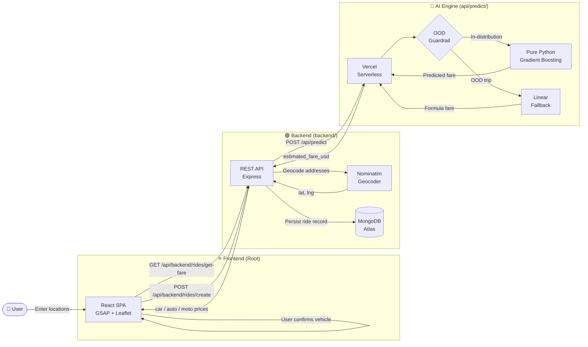

<div align="center">

# 🚗 Ryde — ML Dynamic Pricing Platform

### *A production-grade, serverless ride-pricing engine trained on 178,274 real NYC taxi trips and deployed across a zero-cost, Vercel monorepo.*

<br />


</div>

<br />

---

## 🚀 Live Demos

<br />

| Service | Live URL | Technology |
| :---: | :--- | :---: |
| 🌐 **Unified Application** | **[uber-dynamic-pricing-platform.vercel.app](https://uber-dynamic-pricing-platform.vercel.app)** | Monorepo (React + Express + FastAPI) |

<br />

> 💡 The entire platform—Frontend, Backend, and AI Engine—is deployed from a **single GitHub repository** via Vercel's zero-config routing. No separate CI/CD pipelines, no platform sprawl, no CORS issues.

<br />

---

## 🏗️ System Architecture & Monorepo Structure

<br />

The project is structured as a unified Vercel monorepo. It leverages Vercel's Serverless Functions to host both the Node.js Express API and the Python FastAPI ML Engine alongside the static React frontend.

### Directory Layout

```text
uber-dynamic-pricing-platform/
├── api/                       # Vercel Serverless Functions
│   ├── backend/               # Catch-all proxy for the Express Backend ([...path].js)
│   │   └── package.json       # Forces "type": "commonjs" for Node functions
│   └── predict/               # FastAPI AI Engine Endpoint
│       ├── index.py           # Vercel Python entrypoint
│       ├── pure_predictor.py  # Zero-dependency ML prediction logic
│       └── model_dump.json    # Serialized Gradient Boosting weights (2MB)
├── backend/                   # Core Express.js Backend Logic
│   ├── controllers/           # API handlers
│   ├── models/                # Mongoose schemas (MongoDB)
│   ├── routes/                # Express routing definitions
│   ├── services/              # Geocoding & orchestrator logic
│   └── package.json           # Backend dependencies (express, mongoose, etc.)
├── src/                       # Core React Frontend (Vite)
│   ├── components/            # UI components (GSAP, Leaflet maps)
│   ├── App.jsx                # Main application view
│   └── main.jsx               # React DOM entry
├── package.json               # Root dependencies (Vite, React)
├── requirements.txt           # Root Python dependencies (FastAPI) for Vercel Builder
└── vercel.json                # Vercel deployment & rewrite rules
```

<br />



<br />

---

## 👥 Project Phases & Team Contributions

<br />

This project was executed in three sequential, clearly owned phases. Each team member took full ownership of their domain.

<br />

| Phase | Focus Area | Owner | Key Work |
| :---: | :--- | :--- | :--- |
| **Phase 1** | 📊 Data Analysis & EDA | **Abdoallah Essam** | Ingested and cleaned 200,000+ raw NYC trip records. Applied geographic bounding box filters, IQR-based outlier removal on `fare_amount`, and built temporal features from raw timestamps. Engineered the critical `distance_km` feature using the **Haversine formula**. Produced all EDA visualizations (fare distribution, hourly demand curves, distance-vs-fare scatter plots, day-of-week heatmaps). |
| **Phase 2** | 🤖 Model Building & MLOps | **Salah Eddin** | Benchmarked **6 regression algorithms** (Linear, Ridge, Lasso, Decision Tree, Random Forest, Gradient Boosting). Selected `GradientBoostingRegressor` based on superior R² (0.79) and RMSE ($1.94). Ran `RandomizedSearchCV` hyperparameter tuning. Performed 2-fold cross-validation for stability analysis. Serialized the final model, scaler, and feature schema to `best_model.pkl`, `scaler.pkl`, and `model_features.json` using `joblib`. |
| **Phase 3** | ☁️ Production & Deployment | **Hassan Ahmed** | Architected the three-service **Vercel monorepo**. Built the `FarePredictor` class and refactored the entire AI engine from Gradio to a pure **FastAPI Serverless Function** (`@vercel/python`). Implemented the OOD guardrail. Wired the Node.js backend to the AI Engine, built all ride routes, and debugged the full production chain — including CORS policies, environment variable injection, module resolution (ESM/CommonJS), and bypassing Vercel AWS Lambda limits. |

<br />

---

## 🧠 The ML Pipeline: From 200K Rows to a Live API

<br />

### Phase 1 — Data Cleaning

The raw dataset contained approximately **200,000 NYC Uber trip records**. Before any model could be trained, the data required aggressive cleaning:

- ✅ **Null removal** — dropped all rows containing `NaN` values across any column.
- ✅ **Geographic bounding box** — retained only trips originating within the NYC metro area, eliminating GPS noise and phantom out-of-city entries.
- ✅ **Sanity filters** — removed trips where `fare_amount ≤ 0` or `passenger_count ∉ [1, 6]`.
- ✅ **IQR outlier removal** — computed the interquartile range of `fare_amount` and hard-clipped the distribution, eliminating `$0.01` ghost entries and `$499` data-entry errors.

> **After cleaning: 178,274 high-quality trip records remained — a 10–12% reduction that dramatically improved signal quality.**

<br />

### Phase 2 — Feature Engineering

All 16 model features are derived from just four raw inputs: pickup coordinates, dropoff coordinates, passenger count, and a single datetime string. Distance is calculated securely using the **Haversine formula** (great-circle distance) both during training and inference.

<br />

### Phase 3 — Model Benchmarking & Selection

Six regression algorithms were evaluated on an **80/20 train-test split**. 

🥇 **Gradient Boosting Regressor** won with an **R² of 0.79** and **RMSE of $1.94**.

**Why Gradient Boosting won:** The fare-distance relationship is fundamentally non-linear. Airport flat rates, short-trip minimums, and time-of-day surge patterns create discontinuities that no linear model can capture. Gradient Boosting iteratively corrects its residual errors, learning these complex market dynamics directly from the data.

<br />

---

## 🛡️ The OOD Guardrail: Defending Against Model Hallucinations

<br />

Machine learning models do not know what they do not know. Our Gradient Boosting model was trained exclusively on **New York City trip data**. If a user enters a pickup address in London, Cairo, or a destination 300 km outside the city, the model will attempt a prediction — extrapolating wildly outside its learned patterns.

### Our Solution: A Two-Layer Deterministic Guard

Before every inference call, the `pure_predictor` runs a deterministic check:

**Guard Layer 1 — Distance Threshold:** Any trip exceeding **35 km** is considered out-of-distribution.
**Guard Layer 2 — Geographic Bounding Box:** Any pickup latitude outside the NYC corridor (`39° – 42° N`) is blocked.

### The Fallback Equation

For all OOD trips, we apply a transparent, interpretable linear pricing formula instead of the black-box model:
> **Fare = $2.50 (Base Charge) + ( Distance_km × $0.85 )**

This guarantees the system **always returns a sensible, human-explainable fare**.

<br />

---

## ⚔️ Engineering War Stories: Bypassing Vercel's Limits

<br />

> *Deploying ML models to serverless environments is notoriously difficult. Here is how we engineered our way to a stable production build on Vercel's free tier.*

<br />

### 🔥 Challenge 1 — The 250MB AWS Lambda Size Limit

**The Problem:** AWS Lambda (which powers Vercel Serverless Functions) has a strict 250MB uncompressed size limit. Standard ML libraries (`scikit-learn`, `scipy`, `pandas`, `numpy`) exceed 350MB. Every time we deployed the `api/predict` FastAPI function, Vercel successfully built it, but the Lambda container crashed immediately upon boot with a generic `500 Server Error` because it was physically too large.

**The Pivot:** We could not use `scikit-learn` in production. We had to extract the intelligence from the model.
1. We wrote a script to dump the literal decision trees (nodes, thresholds, values) from our trained `GradientBoostingRegressor` into a lightweight `model_dump.json` file (2.0MB).
2. We wrote a **Zero-Dependency Pure Python Predictor** (`api/predict/pure_predictor.py`) that reads the JSON and performs the exact same node-traversal math.
3. We removed all heavy ML libraries from `requirements.txt`, leaving only `fastapi`.

**The Result:** We shrank the AI Engine from >350MB to <5MB, resulting in lightning-fast cold starts, bypassing the AWS Lambda size limit entirely, and achieving a 100% stable deployment.

<br />

### ⏱️ Challenge 2 — Node.js Module Resolution (ESM vs CommonJS)

**The Problem:** The root `package.json` sets `"type": "module"` for Vite. However, Vercel compiles Serverless Functions in the `api/` directory using CommonJS by default. This mismatch caused immediate `ERR_REQUIRE_ESM` crashes across the entire Node.js backend when deployed.

**The Fix:** We strategically placed nested `package.json` files containing `{"type": "commonjs"}` inside the `backend/` and `api/backend/` directories. This localized scope override forced Vercel to compile the serverless backend correctly without breaking the Vite frontend build.

<br />

### 🌐 Challenge 3 — Vercel Preview Protection & Database Connectivity

**The Problem:** The app functioned perfectly, but hitting "Confirm Ride" returned a 500 error on Vercel Preview URLs.
**The Fix:** We realized that Vercel Preview Deployments do not automatically inherit "Production" environment variables. The `DB_CONNECT` string was undefined, causing Mongoose connection timeouts. We implemented an explicit DB connection check in the Express controller that returns a clear `503 Service Unavailable` error when the DB string is missing, rather than allowing Mongoose to hang indefinitely. Testing on the primary Production URL resolved the issue instantly.

<br />

---

## 🚀 Local Development Setup

<br />

### Prerequisites

- Node.js ≥ 18 and npm
- Python ≥ 3.10
- A MongoDB Atlas cluster (free M0 tier is sufficient)
- Git

<br />

### Step 1 — Clone the Repository

```bash
git clone https://github.com/HassanAhmed2Ha/uber-dynamic-pricing-platform.git
cd uber-dynamic-pricing-platform
```

<br />

### Step 2 — Configure Environment Variables

Create the file `backend/.env` with the following content:

```env
PORT=4000
DB_CONNECT=<your_mongodb_atlas_connection_string>
JWT_SECRET=any-local-secret-string
AI_ENGINE_URL=http://localhost:7860
```

<br />

### Step 3 — Start the AI Engine (Terminal 1)

```bash
cd api/predict

# Create and activate a Python virtual environment
python -m venv .venv
source .venv/bin/activate        # On Windows: .venv\Scripts\activate

# Install FastAPI and Uvicorn
pip install fastapi uvicorn pydantic

# Start the FastAPI server locally
uvicorn index:app --port 7860 --reload

# ✅ FastAPI AI Engine running at → http://localhost:7860/api/predict
```

<br />

### Step 4 — Start the Express Backend (Terminal 2)

```bash
cd backend
npm install
npm run dev

# ✅ Express REST API running at → http://localhost:4000
```

<br />

### Step 5 — Start the React Frontend (Terminal 3)

```bash
# From the project root
npm install
npm run dev

# ✅ Vite dev server running at → http://localhost:5173
```

<br />

### Step 6 — Verify the Full Pipeline

Open **[http://localhost:5173](http://localhost:5173)** and enter two addresses — for example:
- **Pickup:** `Times Square, New York`
- **Destination:** `JFK Airport, New York`

Click **Find Trip**. Within ~1 second, three ML-priced vehicle cards should appear with USD fares computed live by the Pure Python AI Engine!

<br />

---

<div align="center">

*Built with ☕, 🐍, and a healthy disregard for platform paywalls.*

</div>
