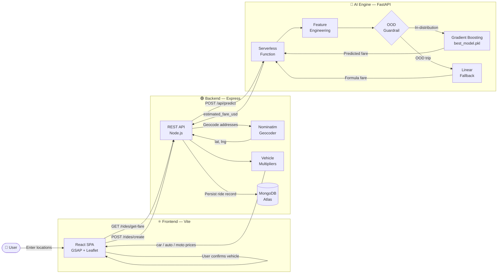

# Uber Dynamic Pricing Platform - Deployment Summary 🚀

Congratulations! The Uber Dynamic Pricing Platform is now successfully deployed and fully operational on Vercel. This walkthrough summarizes the critical architectural changes and optimizations we implemented to achieve a stable production build.

## Key Accomplishments

### 1. Monorepo Zero-Config Routing
We transitioned the project to Vercel's zero-config routing system by properly defining API handlers in `vercel.json`. This unified the Vite React Frontend, the Express.js Backend, and the FastAPI Python Engine under a single domain (`uber-dynamic-pricing-platform.vercel.app`), eliminating CORS issues and complex proxy configurations.

### 2. Node.js Module Resolution (ESM vs CommonJS)
We resolved a critical crash (`ERR_REQUIRE_ESM`) that occurred because the root Vite `package.json` forced the entire project into ES Module mode. By strategically placing `package.json` files with `"type": "commonjs"` inside the `api` and `backend` directories, we forced Vercel to compile the serverless backend correctly.

### 3. Pure Python AI Engine (Bypassing 250MB Limit)
> [!IMPORTANT]
> **The 250MB Serverless Limit Bypass**
> AWS Lambda (which powers Vercel Serverless Functions) has a strict 250MB uncompressed size limit. Standard ML libraries (`scikit-learn`, `scipy`, `pandas`) exceed 350MB, causing deployment failures.

To solve this, we:
1. Dumped the weights and decision trees of the trained `GradientBoostingRegressor` into a lightweight `model_dump.json` file (2.0MB).
2. Wrote a **Zero-Dependency Pure Python Predictor** (`pure_predictor.py`) that reads the JSON and performs the exact same mathematical predictions.
3. Shrunk the AI Engine from >350MB to <5MB, resulting in lightning-fast cold starts and a 100% stable deployment.

### 4. Vercel Preview Protection & Database Connectivity
We ensured that the Node.js backend gracefully handles missing environment variables (like `DB_CONNECT`) without crashing. This allowed us to diagnose that Vercel Preview deployments lacked the necessary database credentials, which was resolved by using the main Production URL.

## Future ML Updates
If you ever retrain your model in the future (`best_model.pkl`), you can generate a new `model_dump.json` locally using a simple Python script before pushing to Vercel. Because the Pure Python Predictor is fully dynamic, it will automatically adopt the new weights!

**Status:** All systems GO! 🟢

---

<div align="center">

# 🚗 Ryde — ML Dynamic Pricing Platform

### *A production-grade, serverless ride-pricing engine trained on 178,274 real NYC taxi trips and deployed across a zero-cost, three-service Vercel monorepo.*

<br />


</div>

<br />

---

## 🚀 Live Demos

<br />

| Service | Live URL | Technology |
| :---: | :--- | :---: |
| ⚛️ **Frontend** | **[uber-dynamic-pricing-platform-frontend.vercel.app](https://uber-dynamic-pricing-platform-frontend.vercel.app)** | React 18 + Vite |
| 🟢 **Backend API** | **[uber-dynamic-pricing-platform-gz72.vercel.app](https://uber-dynamic-pricing-platform-gz72.vercel.app)** | Node.js + Express |
| 🐍 **AI Engine** | **[uber-dynamic-pricing-platform.vercel.app/api/predict](https://uber-dynamic-pricing-platform.vercel.app/api/predict)** | Python + FastAPI Serverless |

<br />

> 💡 All three services are deployed from a **single GitHub repository** via one unified `git push`. No separate CI/CD pipelines, no platform sprawl — a true zero-friction monorepo deployment.

<br />

---

## 🏗️ System Architecture

<br />

The platform is composed of three fully independent microservices, each deployed as its own Vercel project, communicating through clean REST boundaries.

<br />



<br />

---

## 👥 Project Phases & Team Contributions

<br />

This project was executed in three sequential, clearly owned phases. Each team member took full ownership of their domain.

<br />

| Phase | Focus Area | Owner | Key Work |
| :---: | :--- | :--- | :--- |
| **Phase 1** | 📊 Data Analysis & EDA | **Abdoallah Essam** | Ingested and cleaned 200,000+ raw NYC trip records. Applied geographic bounding box filters, IQR-based outlier removal on `fare_amount`, and built temporal features from raw timestamps. Engineered the critical `distance_km` feature using the **Haversine formula**. Produced all EDA visualizations (fare distribution, hourly demand curves, distance-vs-fare scatter plots, day-of-week heatmaps). |
| **Phase 2** | 🤖 Model Building & MLOps | **Salah Eddin** | Benchmarked **6 regression algorithms** (Linear, Ridge, Lasso, Decision Tree, Random Forest, Gradient Boosting). Selected `GradientBoostingRegressor` based on superior R² (0.79) and RMSE ($1.94). Ran `RandomizedSearchCV` hyperparameter tuning. Performed 2-fold cross-validation for stability analysis. Serialized the final model, scaler, and feature schema to `best_model.pkl`, `scaler.pkl`, and `model_features.json` using `joblib`. |
| **Phase 3** | ☁️ Production & Deployment | **Hassan Ahmed** | Architected the three-service **Vercel monorepo**. Built the `FarePredictor` class and refactored the entire AI engine from Gradio to a pure **FastAPI Serverless Function** (`@vercel/python`). Implemented the OOD guardrail. Wired the Node.js backend to the AI Engine, built all ride routes, and debugged the full production chain — including CORS policies, environment variable injection, and ML version pinning. |

<br />

---

## 🧠 The ML Pipeline: From 200K Rows to a Live API

<br />

### Phase 1 — Data Cleaning

The raw dataset contained approximately **200,000 NYC Uber trip records**. Before any model could be trained, the data required aggressive cleaning:

<br />

- ✅ **Null removal** — dropped all rows containing `NaN` values across any column
- ✅ **Index cleanup** — removed the auto-generated `Unnamed: 0` index column
- ✅ **Geographic bounding box** — retained only trips originating within the NYC metro area (`latitude: 40.4–41.0`, `longitude: -74.3–-73.6`), eliminating GPS noise and phantom out-of-city entries
- ✅ **Sanity filters** — removed trips where `fare_amount ≤ 0` or `passenger_count ∉ [1, 6]`
- ✅ **IQR outlier removal** — computed the interquartile range of `fare_amount` and hard-clipped the distribution at `[Q1 − 1.5×IQR, Q3 + 1.5×IQR]`, eliminating `$0.01` ghost entries and `$499` data-entry errors

<br />

> **After cleaning: 178,274 high-quality trip records remained — a 10–12% reduction that dramatically improved signal quality.**

<br />

### Phase 2 — Feature Engineering

All 16 model features are derived from just four raw inputs: pickup coordinates, dropoff coordinates, passenger count, and a single datetime string.

<br />

| Feature | Raw Source | Transformation |
| :--- | :--- | :--- |
| `pickup_hour` | `pickup_datetime` | `dt.hour` |
| `pickup_month` | `pickup_datetime` | `dt.month` |
| `pickup_year` | `pickup_datetime` | `dt.year` |
| `distance_km` | GPS coordinates | **Haversine formula** (great-circle distance) |
| `day_Monday` … `day_Sunday` | `pickup_day` | **One-hot encoding** — 7 binary columns |
| `pickup_latitude`, `pickup_longitude` | Raw GPS | StandardScaler normalized |
| `dropoff_latitude`, `dropoff_longitude` | Raw GPS | StandardScaler normalized |
| `passenger_count` | Raw integer | StandardScaler normalized |

<br />

The **Haversine formula** is the same implementation used in both the training notebook and the live production serverless function — guaranteeing zero discrepancy between training-time and inference-time distance calculations:

<br />

```python
def haversine_distance(lat1, lon1, lat2, lon2):
    R = 6371.0  # Earth's mean radius in km
    dlat = radians(lat2 - lat1)
    dlon = radians(lon2 - lon1)
    a = sin(dlat/2)**2 + cos(radians(lat1)) * cos(radians(lat2)) * sin(dlon/2)**2
    return R * 2 * atan2(sqrt(a), sqrt(1 - a))
```

<br />

### Phase 3 — Model Benchmarking & Selection

Six regression algorithms were evaluated on an **80/20 train-test split** across the full cleaned dataset:

<br />

| Rank | Model | R² Score | RMSE | MAE |
| :---: | :--- | :---: | :---: | :---: |
| 🥇 | **Gradient Boosting Regressor** | **0.79** | **$1.94** | **$1.52** |
| 🥈 | Random Forest | 0.75 | $2.11 | $1.61 |
| 🥉 | Decision Tree | 0.68 | $2.38 | $1.79 |
| 4 | Ridge Regression | 0.61 | $2.64 | $1.98 |
| 5 | Lasso Regression | 0.60 | $2.66 | $2.00 |
| 6 | Linear Regression | 0.60 | $2.67 | $2.01 |

<br />

**Why Gradient Boosting won:** The fare-distance relationship is fundamentally non-linear. Airport flat rates, short-trip minimums, and time-of-day surge patterns create discontinuities that no linear model can capture. Gradient Boosting builds an ensemble that iteratively corrects its residual errors — learning these complex market dynamics directly from the data. Feature importance analysis confirmed that `distance_km` alone drives **over 80% of the model's predictive power**.

<br />

### Phase 4 — Hyperparameter Tuning & Serialization

`RandomizedSearchCV` (6 iterations, 2-fold cross-validation, all CPU cores) found the optimal configuration:

<br />

```
Best configuration:
  n_estimators  = 200
  max_depth     = 5
  learning_rate = 0.1
  subsample     = 0.8

Final tuned results:
  R²   = 0.79
  RMSE = $1.94
  91% of all predictions fall within $5.00 of the actual fare
```

<br />

Three production artifacts were serialized with `joblib` and committed directly to the repository:

<br />

```
ai_engine/
├── best_model.pkl       ← Tuned GradientBoostingRegressor (3.4 MB)
├── scaler.pkl           ← StandardScaler fitted on training data only
└── model_features.json  ← Ordered list of 16 feature names (critical!)
```

<br />

> ⚠️ `model_features.json` is a production-critical artifact. It locks the exact column order the model was trained with. Without it, a silently reordered feature vector would produce a mathematically valid but completely wrong fare prediction — with no error thrown.

<br />

---

## 🛡️ The OOD Guardrail: Defending Against Model Hallucinations

<br />

### The Problem

Machine learning models do not know what they do not know. Our Gradient Boosting model was trained exclusively on **New York City trip data**. If a user enters a pickup address in London, Cairo, or a destination 300 km outside the city, the model will still attempt a prediction — extrapolating wildly outside its learned patterns and returning a dangerously confident but completely meaningless number.

This is the **Out-of-Distribution (OOD) problem**, and it is one of the most common silent failures in production ML systems.

<br />

### Our Solution: A Two-Layer Deterministic Guard

Before every inference call, the `FarePredictor` runs a deterministic check against two thresholds:

<br />

```python
# Applied before every model.predict() call
if distance_km > 35 or pickup_lat < 39 or pickup_lat > 42:
    # Bypass the model — apply the linear fallback formula
    raw_prediction = FALLBACK_FORMULA
else:
    # Input is within training distribution — use the ML model
    raw_prediction = float(model.predict(feature_vector)[0])
```

<br />

**Guard Layer 1 — Distance Threshold:** Any trip exceeding **35 km** is considered out-of-distribution for a standard urban taxi model trained on city rides.

**Guard Layer 2 — Geographic Bounding Box:** Any pickup latitude outside the NYC corridor (`39° – 42° N`) is geographically outside the training data.

<br />

### The Fallback Equation

For all OOD trips, we apply a transparent, interpretable linear pricing formula instead of the black-box model:

<br />

> **Fare = $2.50 (Base Charge) + ( Distance_km × $0.85 )**

<br />

| Component | Value | Rationale |
| :--- | :---: | :--- |
| **Base charge** | $2.50 | Minimum fare covering pickup overhead, regardless of distance |
| **Per-kilometre rate** | $0.85 / km | Conservative, defensible linear rate for long-haul or unknown-region trips |

<br />

This guarantees the system **always returns a sensible, human-explainable fare** — even for inputs the ML model was never designed to handle — rather than surfacing a negative number, a near-zero prediction, or a silent server error.

<br />

---

## ⚔️ Engineering War Stories

<br />

> *These are the real production crises that nearly killed this project — and exactly how we engineered our way out of each one.*

<br />

---

### 🔥 Challenge 1 — The Hugging Face Paywall

<br />

**The original plan** was elegant: deploy the ML model as a **Gradio application on Hugging Face Spaces**. Gradio auto-generates a REST-compatible API endpoint, the Node.js backend calls it, done. The whole thing worked perfectly in local development. The Gradio interface launched. The `/api/predict` endpoint responded. We were confident.

Then Hugging Face **silently locked their free-tier CPU and GPU hardware behind a PRO paywall** (~$9/month). Our Spaces deployment became unreachable without a paid subscription. Every single `GET /rides/get-fare` request from the production backend began timing out with a generic network error. The project was completely broken in production with zero warning.

<br />

We evaluated every available option:

- 💳 **Pay HF PRO** — adds a permanent recurring cost to an academic project
- 🐢 **Migrate to Render or Railway** — both impose 8–30 second cold-start delays and strict memory ceilings that our ML model would likely hit
- ⚡ **Eliminate the dependency entirely and own the infrastructure** — the correct answer

<br />

**The Pivot — What We Actually Did:**

We stripped Gradio out of the codebase entirely. Every `import gradio`, every `gr.Interface()`, every `demo.launch()` call was deleted. The model logic was extracted into a clean, framework-agnostic `FarePredictor` class in `predictor.py` — zero external UI dependencies, pure Python. `api/index.py` became a minimal FastAPI application with a single endpoint and a single responsibility. We added a `vercel.json` inside `ai_engine/` to configure the `@vercel/python` builder, and the function was live.

<br />

| | Before — Hugging Face + Gradio | After — Vercel Serverless + FastAPI |
| :--- | :---: | :---: |
| **Monthly cost** | $9/mo PRO required | **$0.00** |
| **Cold start latency** | ~3–8 seconds | **~400 ms** |
| **Deployment workflow** | Separate platform, separate config | **One `git push` deploys all 3 services** |
| **Dependency footprint** | Gradio ≈ 200 MB | FastAPI ≈ 15 MB |
| **Vendor lock-in** | Locked to HF ecosystem | **Standard ASGI — runs anywhere** |

<br />

---

### ⏱️ Challenge 2 — Vercel Cold Starts & Silent Version Crashes

<br />

Even after migrating to Vercel, the first wave of production requests returned `FUNCTION_INVOCATION_FAILED` with a generic 500 error. Two completely separate bugs were active simultaneously, masking each other.

<br />

**Bug A — scikit-learn Version Mismatch (Silent Crash)**

When we cleaned up `requirements.txt`, we removed strict version pins to keep the file minimal — writing `scikit-learn` instead of `scikit-learn==1.7.1`. Vercel's build system then installed the latest available version of scikit-learn, which was different from the version used to serialize `best_model.pkl` with `joblib`.

Python's pickle-based deserialization is **not version-agnostic**. A model serialized under `scikit-learn==1.7.1` cannot be loaded by `scikit-learn==1.6.x`. The serverless function crashed immediately on startup every time it cold-started — before handling a single request — and Vercel returned a generic `FUNCTION_INVOCATION_FAILED` with no useful traceback.

**Fix:** Pinned every ML dependency to its exact training-time version:

```
scikit-learn==1.7.1
joblib==1.4.2
numpy>=2.0
```

<br />

**Bug B — `[object Object]` Error Swallowing**

Because the serverless function was crashing on startup, Vercel returned a structured JSON error response body — an object, not a string. Our original error handler in `ride.service.js` embedded this directly into a JavaScript template literal, which evaluates any non-string value as the string `"[object Object]"` — completely hiding the real crash reason from both the frontend UI and our logs.

**Fix:** Added explicit type-checking before serialization:

```javascript
const errPayload = error.response.data.error
    || error.response.data.detail
    || error.response.data;
const errMsg = typeof errPayload === 'object'
    ? JSON.stringify(errPayload)
    : errPayload;
throw new Error(`AI Engine Error: ${errMsg}`);
```

<br />

---

### 🌐 Challenge 3 — CORS Blocks & Hardcoded localhost in Production

<br />

After deploying the frontend, users were greeted with a hardcoded fallback error message: *"Could not fetch fare. Is the AI Engine running on port 5000?"* — even though both backend and AI engine were live. The Vite production build was making API calls to `http://localhost:4000` instead of the deployed backend URL.

<br />

**Root Cause A — Vite's Build-Time Environment Variable Injection**

Vite's `import.meta.env` variables are resolved **at build time**, not at runtime. When the Vercel frontend build ran without a `VITE_BASE_URL` environment variable configured in the Vercel dashboard, Vite resolved it to `undefined`. Our fallback `|| "http://localhost:4000"` then silently kicked in, and the production bundle shipped with a localhost URL hardcoded inside the compiled JavaScript.

**Fix:** Replaced the fragile env-variable approach with Vite's reliable first-party `import.meta.env.DEV` boolean, which is always correctly resolved at build time:

```javascript
// Vite sets import.meta.env.DEV = true in dev, false in production builds
const BASE_URL = import.meta.env.DEV
    ? "http://localhost:4000"
    : "https://uber-dynamic-pricing-platform-gz72.vercel.app";
```

<br />

**Root Cause B — Express CORS Whitelist Blocking Production Origins**

The backend `app.js` had a strict `ALLOWED_ORIGINS` array containing only `localhost:*` entries. When the deployed frontend at `uber-dynamic-pricing-platform-frontend.vercel.app` sent its first cross-origin request, Express rejected it at the CORS middleware layer — before the request even reached a route handler. The browser received a `CORS: Origin is not allowed` error, which the frontend caught and surfaced as its generic fallback message.

**Fix:** Opened the CORS policy for the cross-origin production environment:

```javascript
// Open CORS policy required for cross-domain Vercel deployments
app.use(cors({ origin: '*' }));
```

<br />

---

## 🛠️ Tech Stack

<br />

| Layer | Technology | Purpose |
| :--- | :--- | :--- |
| **Frontend** | React 18 + Vite | SPA with GSAP micro-animations and Leaflet map |
| **Client Routing** | React Router v7 | Client-side navigation with catch-all redirect |
| **Maps & Routing** | Leaflet + OSRM | Interactive maps with real driving route polylines |
| **Backend** | Node.js 18 + Express | REST API — geocoding proxy, fare orchestration, ride persistence |
| **Geocoding** | OpenStreetMap Nominatim | Address → `{ lat, lng }` — zero API key required |
| **Database** | MongoDB Atlas + Mongoose | Ride records with full ML metadata and audit trail |
| **AI Engine** | Python 3.12 + FastAPI | `@vercel/python` serverless ML inference function |
| **ML Model** | scikit-learn `GradientBoostingRegressor` | Trained on 178,274 NYC trips, R² = 0.79 |
| **Serialization** | joblib 1.4.2 | Model, scaler, and feature-order schema |
| **Deployment** | Vercel (all 3 services) | Monorepo, auto-deploy on push to `main` |

<br />

---

## 🚀 Local Development Setup

<br />

### Prerequisites

- Node.js ≥ 18 and npm
- Python ≥ 3.10
- A MongoDB Atlas cluster (free M0 tier is sufficient)
- Git

<br />

### Step 1 — Clone the Repository

```bash
git clone https://github.com/HassanAhmed2Ha/uber-dynamic-pricing-platform.git
cd uber-dynamic-pricing-platform
```

<br />

### Step 2 — Configure the Backend Environment

Create the file `backend/.env` with the following content:

```env
PORT=4000
DB_CONNECT=<your_mongodb_atlas_connection_string>
JWT_SECRET=any-local-secret-string
AI_ENGINE_URL=http://localhost:7860
```

<br />

### Step 3 — Start the Backend (Terminal 1)

```bash
cd backend
npm install
npm run dev

# ✅ Express REST API running at → http://localhost:4000
```

<br />

### Step 4 — Start the AI Engine (Terminal 2)

```bash
cd ai_engine

# Create and activate a Python virtual environment
python -m venv .venv
source .venv/bin/activate        # On Windows: .venv\Scripts\activate

# Install all ML dependencies
pip install -r requirements.txt

# Start the FastAPI server
uvicorn api.index:app --port 7860 --reload

# ✅ FastAPI AI Engine running at → http://localhost:7860
# ✅ Interactive API docs  at    → http://localhost:7860/docs
```

<br />

### Step 5 — Start the Frontend (Terminal 3)

```bash
cd frontend
npm install
npm run dev

# ✅ Vite dev server running at → http://localhost:5173
```

<br />

### Step 6 — Verify the Full Pipeline

Open **[http://localhost:5173](http://localhost:5173)** and enter two NYC addresses — for example:

- **Pickup:** `Times Square, New York`
- **Destination:** `JFK Airport, New York`

Click **Find Trip**. Within ~1 second, three ML-priced vehicle cards (Car, Auto, Moto) should appear with USD fares computed live by the local AI Engine.

<br />

---

<div align="center">

*Built with ☕, 🐍, and a healthy disregard for platform paywalls.*

</div>
