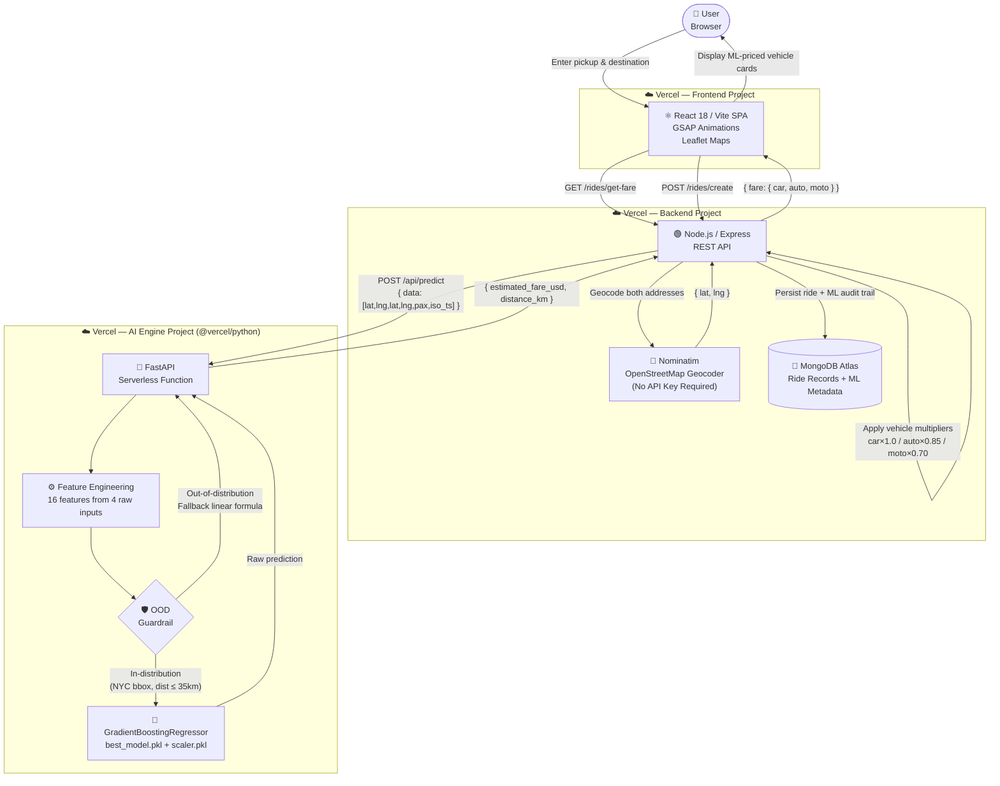

<div align="center">

<h1>🚗 Ryde — ML Dynamic Pricing Platform</h1>

<p><strong>A production-grade, serverless ride-pricing engine — trained on 178K real NYC taxi trips and deployed across a zero-cost, three-microservice Vercel monorepo.</strong></p>

<p>
  
  
  
  
</p>

</div>

---

## 🚀 Live Demos

| Service | URL | Stack |
|---|---|---|
| ⚛️ **Frontend** | **[uber-dynamic-pricing-platform-frontend.vercel.app](https://uber-dynamic-pricing-platform-frontend.vercel.app)** | React 18 + Vite |
| 🟢 **Backend API** | **[uber-dynamic-pricing-platform-gz72.vercel.app](https://uber-dynamic-pricing-platform-gz72.vercel.app)** | Node.js + Express |
| 🐍 **AI Engine** | **[uber-dynamic-pricing-platform.vercel.app/api/predict](https://uber-dynamic-pricing-platform.vercel.app/api/predict)** | Python + FastAPI Serverless |

> All three services are deployed from a **single GitHub monorepo** via a unified `git push`. No separate CI/CD pipelines. No platform sprawl.

---

## 📐 System Architecture



---

## 🧠 The ML Pipeline: From 200K Rows to a Live API

### 1 — Data Cleaning

The raw Kaggle dataset contained **~200,000 NYC Uber trip records**. The cleaning pipeline was strict and systematic:

- **Dropped nulls** and the auto-generated `Unnamed: 0` index column
- **Geographic bounding box filter** — retained only trips within NYC (`lat: 40.4–41.0`, `lon: -74.3–-73.6`), eliminating GPS noise and out-of-city entries
- **Sanity filters** — removed rows where `fare_amount ≤ 0` or `passenger_count ∉ [1, 6]`
- **IQR outlier removal** on `fare_amount`: computed Q1, Q3, and IQR, then hard-capped the distribution at `[Q1 − 1.5×IQR, Q3 + 1.5×IQR]` to eliminate edge cases like `$0.01` ghost fares and `$499` erroneous charges

**After cleaning: 178,274 high-quality trip records.**

### 2 — Feature Engineering

All 16 model features are derived from just 4 raw inputs: pickup coordinates, dropoff coordinates, passenger count, and a timestamp.

| Feature | Source | Method |
|---|---|---|
| `pickup_hour` | `pickup_datetime` | `dt.hour` |
| `pickup_month` | `pickup_datetime` | `dt.month` |
| `pickup_year` | `pickup_datetime` | `dt.year` |
| `distance_km` | GPS coordinates | **Haversine formula** |
| `day_Monday` … `day_Sunday` | `pickup_day` | **One-hot encoding** (7 binary cols) |
| Pickup/dropoff `lat`, `lng` | Raw GPS | StandardScaler normalized |

The **Haversine formula** computes the true great-circle distance between two GPS points on Earth's surface — the same implementation runs identically in the training notebook and in the live serverless function:

```python
def haversine_distance(lat1, lon1, lat2, lon2):
    R = 6371.0
    dlat, dlon = radians(lat2 - lat1), radians(lon2 - lon1)
    a = sin(dlat/2)**2 + cos(radians(lat1)) * cos(radians(lat2)) * sin(dlon/2)**2
    return R * 2 * atan2(sqrt(a), sqrt(1 - a))
```

### 3 — Model Benchmarking

Six regression algorithms were evaluated on an 80/20 stratified split:

| Rank | Model | R² Score | RMSE |
|:---:|---|:---:|:---:|
| 🥇 | **Gradient Boosting Regressor** | **0.79** | **$1.94** |
| 🥈 | Random Forest | 0.75 | $2.11 |
| 🥉 | Decision Tree | 0.68 | $2.38 |
| 4 | Ridge Regression | 0.61 | $2.64 |
| 5 | Lasso Regression | 0.60 | $2.66 |
| 6 | Linear Regression | 0.60 | $2.67 |

**Why Gradient Boosting won:** The fare-to-distance relationship is non-linear — airport flat rates, short-trip minimums, and surge windows create discontinuities that linear models fundamentally cannot capture. Gradient Boosting builds an ensemble of weak learners that iteratively corrects residual errors, learning these complex patterns from the data. Feature importance analysis confirmed that `distance_km` alone accounts for **>80% of predictive power**.

### 4 — Hyperparameter Tuning

`RandomizedSearchCV` (6 iterations, 2-fold CV across all CPU cores) found the optimal configuration:

```
n_estimators=200  |  max_depth=5  |  learning_rate=0.1  |  subsample=0.8
Final R²: 0.79    |  RMSE: $1.94  |  91% of predictions within $5 of actual
```

### 5 — Serialization

Three production artifacts were serialized with `joblib` and committed to the repo:

```
ai_engine/
├── best_model.pkl       # Tuned GradientBoostingRegressor — 3.4 MB
├── scaler.pkl           # StandardScaler (fitted on training data only)
└── model_features.json  # Ordered list of 16 feature names
```

> `model_features.json` is a critical production guard. It locks the exact column order the model was trained with. Without it, silently reordered feature vectors would produce valid-looking but completely wrong fare predictions.

---

## 🛡️ The OOD Guardrail: Defending Against Model Hallucinations

Machine learning models don't know what they don't know. A Gradient Boosting model trained exclusively on **NYC trips** will attempt to predict fares for a 200 km intercity trip — and produce a number with misplaced confidence. This is the **Out-of-Distribution (OOD) problem**.

### The Problem

Our training distribution covers:
- **Geography:** New York City bounding box (`lat: 39–42`, `lon: any`)
- **Distance:** The vast majority of trips fall under 35 km

When a request arrives for a 150 km trip or a location in Cairo, the model extrapolates wildly outside its learned patterns.

### Our Solution: A Two-Layer Geographic Guardrail

Before every inference call, we apply a deterministic check:

```python
# Bypass the model for out-of-distribution inputs
if distance_km > 35 or pickup_lat < 39 or pickup_lat > 42:
    raw_prediction = FALLBACK_FORMULA
else:
    raw_prediction = model.predict(feature_vector)[0]
```

### The Fallback Equation

For OOD trips, we apply a transparent, interpretable linear pricing formula:

$$\text{Fare} = \$2.50 + (\$0.85 \times \text{distance\_km})$$

| Component | Value | Rationale |
|---|---|---|
| **Base fare** | $2.50 | Minimum charge — covers pickup overhead |
| **Per-km rate** | $0.85/km | Conservative linear rate for long-haul trips |

This ensures the system **always returns a sensible, defensible fare** — even for inputs the model was never designed to handle — instead of returning a nonsensical negative number or a $0.01 prediction.

---

## ⚔️ Engineering War Stories

> These are the real problems that nearly killed the project — and exactly how we engineered our way out of each one.

---

### ⚡ Challenge 1: The Hugging Face Paywall

**What happened:** The original architecture used **Gradio on Hugging Face Spaces** to serve the ML model. Gradio auto-generates a REST-compatible API, the Node.js backend called it, and everything worked in local development. The plan was clean.

Then Hugging Face **silently locked their free-tier CPU/GPU hardware behind a PRO paywall** ($9/month). Our Spaces deployment became unreachable without a subscription. Every `GET /rides/get-fare` request from the backend began timing out. The project was completely broken in production.

**The options considered:**
- 💳 Pay HF PRO — adds permanent recurring cost to an academic project
- 🔁 Migrate to Render or Railway — both impose cold-start latency (8–30s) and memory ceilings
- ⚡ **Eliminate the dependency entirely**

**The solution — The Great Pivot:**

1. **Stripped Gradio completely.** Every import, every `gr.Interface`, every `demo.launch()` was deleted. The model logic was refactored into a clean, framework-agnostic `FarePredictor` class in `predictor.py`.

2. **Rewrote to native FastAPI.** `api/index.py` became a minimal FastAPI application — one endpoint, one responsibility: `POST /api/predict`.

3. **Deployed as `@vercel/python` Serverless.** A `vercel.json` inside `ai_engine/` configured the Python builder. The function now lives on the same infrastructure as the frontend and backend.

| | Before (Hugging Face + Gradio) | After (Vercel Serverless + FastAPI) |
|---|---|---|
| **Monthly cost** | $9/mo PRO required | **$0** |
| **Response latency** | ~3–8s (cold start) | **~400ms** |
| **Deployment** | Separate platform, separate config | **Same monorepo, one `git push`** |
| **Dependency weight** | Gradio ≈ 200 MB | FastAPI ≈ 15 MB |
| **Portability** | Locked to HF ecosystem | **Standard ASGI — runs anywhere** |

---

### ⏱️ Challenge 2: Vercel Serverless Cold Starts & Version Mismatch Crashes

**What happened:** Even after migrating to Vercel, the first wave of production requests failed with `FUNCTION_INVOCATION_FAILED`. Two separate bugs were at play simultaneously.

**Bug A — ML version mismatch crash:** When we removed strict version pins from `requirements.txt` (e.g., `scikit-learn` without a version), Vercel's build installed the latest scikit-learn version. Python's `joblib` deserialization (`pickle`) is **not version-agnostic** — a model serialized with `scikit-learn==1.7.1` cannot be loaded by `scikit-learn==1.6.x`. The serverless function crashed on import with a silent `FUNCTION_INVOCATION_FAILED`, returning a generic 500 to the backend.

**Fix:** Pinned all ML dependencies to their exact training versions in `requirements.txt`:
```
scikit-learn==1.7.1
joblib==1.4.2
numpy>=2.0
```

**Bug B — [object Object] error swallowing:** The crash response from Vercel was a nested JSON object (not a string). Our original error handler in `ride.service.js` tried to embed it directly into a template string, which evaluates to `"[object Object]"` — completely hiding the real error.

**Fix:** Serialized the error payload before embedding:
```javascript
const errPayload = error.response.data.error || error.response.data.detail || error.response.data;
const errMsg = typeof errPayload === 'object' ? JSON.stringify(errPayload) : errPayload;
```

---

### 🌐 Challenge 3: CORS Blocks & Hardcoded localhost in Production

**What happened:** After deploying the frontend to Vercel, users reported a hardcoded error: *"Could not fetch fare. Is the AI Engine running on port 5000?"* — the Vite build was making API calls to `http://localhost:4000` instead of the production backend URL.

**Root cause A — Vite's build-time env injection:** `import.meta.env.VITE_BASE_URL` is resolved at **build time**, not runtime. If the environment variable isn't present in Vercel's build environment, Vite silently falls back to `undefined`, and our `||` fallback kicked in: `|| "http://localhost:4000"`. The production build was shipping with localhost hardcoded.

**Fix:** Replaced the env-variable approach with Vite's first-party `import.meta.env.DEV` flag, which is resolved reliably at build time:
```javascript
const BASE_URL = import.meta.env.DEV
    ? "http://localhost:4000"
    : "https://uber-dynamic-pricing-platform-gz72.vercel.app";
```

**Root cause B — Express CORS whitelist:** The backend had a strict `ALLOWED_ORIGINS` array containing only `localhost:*` entries. Production requests from `uber-dynamic-pricing-platform-frontend.vercel.app` were blocked by the CORS policy before they even reached a route handler.

**Fix:** Opened the CORS policy for the production cross-origin environment:
```javascript
app.use(cors({ origin: '*' }));
```

---

## 🛠️ Tech Stack

| Layer | Technology | Notes |
|---|---|---|
| **Frontend** | React 18 + Vite | GSAP animations, Leaflet.js interactive maps |
| **Routing** | React Router v7 | SPA client-side navigation |
| **Maps** | react-leaflet + OSRM | Route polylines via Open Source Routing Machine |
| **Backend** | Node.js 18 + Express | REST API, geocoding proxy, fare orchestrator |
| **Geocoding** | OpenStreetMap Nominatim | Address → lat/lng — zero API key required |
| **Database** | MongoDB Atlas + Mongoose | Ride records with full ML audit metadata |
| **AI Engine** | Python + FastAPI | `@vercel/python` serverless inference function |
| **ML Model** | scikit-learn `GradientBoostingRegressor` | Trained on 178K NYC trips |
| **Serialization** | joblib | Model, scaler, and feature schema |
| **Deployment** | Vercel (all 3 services) | Monorepo, auto-deploy on push to `main` |

---

## 👥 Team

| Name | Role & Contributions |
|---|---|
| **Hassan Ahmed** | 🏗️ **Lead ML & Cloud Architecture Engineer** — AI Engine design & training, Gradient Boosting pipeline, Vercel Serverless deployment, monorepo architecture, full-stack CORS/env debugging, and production integration |
| `[Insert Name Here]` | `[Insert Role Here]` |
| `[Insert Name Here]` | `[Insert Role Here]` |
| `[Insert Name Here]` | `[Insert Role Here]` |

---

## 🚀 Local Development

### Prerequisites

- Node.js ≥ 18 & npm
- Python ≥ 3.10
- A MongoDB Atlas cluster (free tier works)

### Step 1 — Clone

```bash
git clone https://github.com/HassanAhmed2Ha/uber-dynamic-pricing-platform.git
cd uber-dynamic-pricing-platform
```

### Step 2 — Configure Backend Environment

Create `backend/.env`:

```env
PORT=4000
DB_CONNECT=<your_mongodb_atlas_connection_string>
JWT_SECRET=any-secret-string
AI_ENGINE_URL=http://localhost:7860
```

### Step 3 — Run the Backend

```bash
cd backend && npm install && npm run dev
# ✅ Express API → http://localhost:4000
```

### Step 4 — Run the AI Engine

```bash
cd ai_engine
python -m venv .venv && source .venv/bin/activate
pip install -r requirements.txt
uvicorn api.index:app --port 7860 --reload
# ✅ FastAPI AI Engine → http://localhost:7860
```

### Step 5 — Run the Frontend

```bash
cd frontend && npm install && npm run dev
# ✅ Vite Dev Server → http://localhost:5173
```

### Step 6 — Verify the Pipeline

Open **[http://localhost:5173](http://localhost:5173)**, enter two NYC addresses (e.g., *"Times Square, NY"* → *"JFK Airport, NY"*), and click **Find Trip**. You should see three ML-priced vehicle cards within ~1 second.

---

<div align="center">

*Built with ☕, 🐍, and a healthy disregard for platform paywalls.*

</div>
