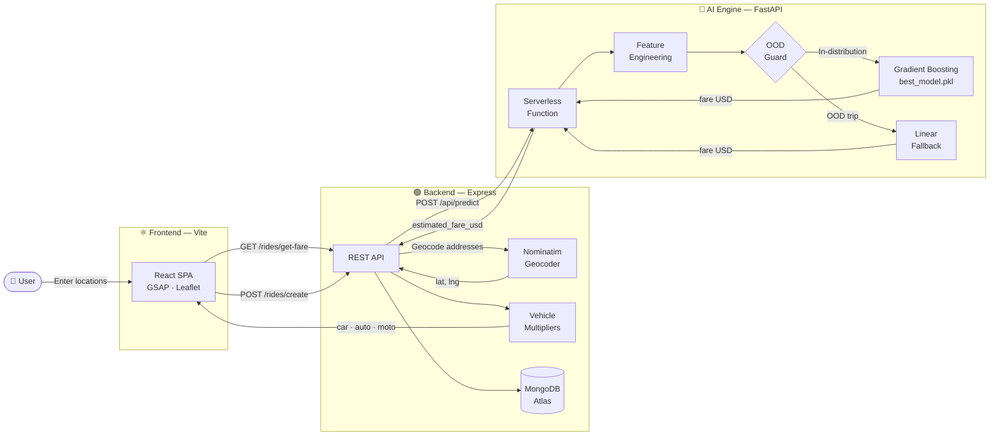

<div align="center">

<br />

<h1>Ryde — ML Dynamic Pricing Platform</h1>

<p>React 18 &nbsp;•&nbsp; Node.js &nbsp;•&nbsp; FastAPI &nbsp;•&nbsp; Scikit-Learn &nbsp;•&nbsp; MongoDB Atlas</p>

<br />

> **Frontend:** [Live Demo](https://uber-dynamic-pricing-platform-frontend.vercel.app) &nbsp;|&nbsp; **Backend:** [API](https://uber-dynamic-pricing-platform-gz72.vercel.app) &nbsp;|&nbsp; **AI Engine:** [Predictor](https://uber-dynamic-pricing-platform.vercel.app/api/predict)

<br />

</div>

A production-grade, serverless ride-pricing engine trained on **178,274 real NYC taxi trips** and deployed across a zero-cost, three-microservice Vercel monorepo. A single `git push` to `main` redeploys all three services simultaneously.

---

## Contents

1. [Architecture](#architecture)
2. [Project Phases & Team](#project-phases--team)
3. [The ML Pipeline](#the-ml-pipeline)
4. [The OOD Guardrail](#the-ood-guardrail)
5. [Engineering Incident Reports](#engineering-incident-reports)
6. [Local Setup](#local-setup)

---

## Architecture



---

## Project Phases & Team

| Phase | Domain | Owner | Responsibilities |
| :---: | :--- | :--- | :--- |
| **01** | Data Analysis & EDA | **Abdoallah Essam** | Ingested and cleaned 200,000+ raw NYC taxi records. Applied geographic bounding-box filters and IQR-based outlier removal on `fare_amount`. Extracted temporal features from raw timestamps. Engineered the `distance_km` feature using the **Haversine formula**. Produced all EDA visualisations — fare distributions, hourly demand curves, and distance-vs-fare scatter plots. |
| **02** | Model Building & MLOps | **Salah Eddin** | Benchmarked six regression algorithms on an 80/20 train-test split. Selected `GradientBoostingRegressor` based on R² = 0.79 and RMSE = $1.94. Ran `RandomizedSearchCV` hyperparameter tuning and 2-fold cross-validation. Serialised the final model, scaler, and feature schema to `best_model.pkl`, `scaler.pkl`, and `model_features.json` using `joblib`. |
| **03** | Production & Deployment | **Hassan Ahmed** | Architected the three-service Vercel monorepo. Refactored the AI engine from Gradio to a pure `@vercel/python` FastAPI Serverless Function. Implemented the OOD guardrail. Built the Node.js REST API, wired all ride routes, and resolved the full production chain — CORS policies, build-time env variable injection, and ML package version pinning. |

---

## The ML Pipeline

<details>
<summary><strong>Phase 1 — Data Cleaning</strong> &nbsp;↓</summary>

<br />

The raw Kaggle dataset contained approximately **200,000 NYC Uber trip records**. The pipeline below reduced this to **178,274 clean rows**.

| Step | Action |
| :--- | :--- |
| Null removal | Dropped all rows with `NaN` values |
| Index cleanup | Removed the auto-generated `Unnamed: 0` column |
| Geographic filter | Kept only trips within the NYC bounding box (`lat: 40.4–41.0`, `lon: -74.3–-73.6`) |
| Sanity filter | Removed `fare_amount ≤ 0` and `passenger_count ∉ [1, 6]` |
| IQR outlier removal | Clipped `fare_amount` to `[Q1 − 1.5×IQR, Q3 + 1.5×IQR]` — eliminated $0.01 ghost fares and $499 entry errors |

<br />

</details>

<details>
<summary><strong>Phase 2 — Feature Engineering</strong> &nbsp;↓</summary>

<br />

All 16 model features are derived from just four raw inputs: coordinates, passenger count, and a timestamp.

| Feature | Source | Method |
| :--- | :--- | :--- |
| `pickup_hour` | `pickup_datetime` | `dt.hour` |
| `pickup_month` | `pickup_datetime` | `dt.month` |
| `pickup_year` | `pickup_datetime` | `dt.year` |
| `distance_km` | GPS coordinates | Haversine formula |
| `day_Monday` … `day_Sunday` | Day name | One-hot encoding — 7 binary columns |
| Coordinates + `passenger_count` | Raw values | StandardScaler normalised |

The Haversine implementation is identical across the training notebook and the live production function — guaranteeing zero discrepancy between training-time and inference-time distance calculations:

```python
def haversine_distance(lat1, lon1, lat2, lon2):
    R = 6371.0
    dlat = radians(lat2 - lat1)
    dlon = radians(lon2 - lon1)
    a = sin(dlat/2)**2 + cos(radians(lat1)) * cos(radians(lat2)) * sin(dlon/2)**2
    return R * 2 * atan2(sqrt(a), sqrt(1 - a))
```

<br />

</details>

<details>
<summary><strong>Phase 3 — Model Benchmarking & Selection</strong> &nbsp;↓</summary>

<br />

Six regression algorithms evaluated on an 80/20 train-test split:

| Rank | Model | R² | RMSE |
| :---: | :--- | :---: | :---: |
| 🥇 | **Gradient Boosting Regressor** | **0.79** | **$1.94** |
| 🥈 | Random Forest | 0.75 | $2.11 |
| 🥉 | Decision Tree | 0.68 | $2.38 |
| 4 | Ridge Regression | 0.61 | $2.64 |
| 5 | Lasso Regression | 0.60 | $2.66 |
| 6 | Linear Regression | 0.60 | $2.67 |

Gradient Boosting won because the fare-distance relationship is non-linear. Airport flat rates, short-trip minimums, and surge windows create discontinuities that no linear model can capture. Feature importance analysis confirmed that `distance_km` alone accounts for **over 80% of predictive power**.

Hyperparameter tuning via `RandomizedSearchCV` (6 iterations, 2-fold CV):

```
n_estimators=200  ·  max_depth=5  ·  learning_rate=0.1  ·  subsample=0.8
Final R²: 0.79  ·  RMSE: $1.94  ·  91% of predictions within $5 of actual fare
```

Three artifacts serialised with `joblib` and committed to the repository:

```
ai_engine/
├── best_model.pkl       ← Tuned GradientBoostingRegressor (3.4 MB)
├── scaler.pkl           ← StandardScaler fitted on training data only
└── model_features.json  ← Ordered list of 16 feature names (critical)
```

<br />

</details>

---

## The OOD Guardrail

A model trained exclusively on NYC data will attempt to predict fares for a 300 km intercity trip or a pickup in Cairo — extrapolating confidently outside everything it learned. This is the **Out-of-Distribution (OOD) problem**.

Before every inference call, a two-layer deterministic gate runs first:

```python
if distance_km > 35 or pickup_lat < 39 or pickup_lat > 42:
    raw_prediction = fallback(distance_km)    # linear formula
else:
    raw_prediction = model.predict(features)  # ML model
```

**Layer 1 — Distance threshold:** trips exceeding **35 km** fall outside the training distribution of standard urban NYC rides.

**Layer 2 — Geographic bounding box:** any pickup latitude outside the NYC corridor (`39°N – 42°N`) is geographically out-of-distribution.

For OOD trips, the model is bypassed entirely and replaced with a transparent, human-readable formula:

<br />

> `Fare = $2.50 (Base) + (Distance_km × $0.85)`

<br />

| Component | Value | Rationale |
| :--- | :---: | :--- |
| Base charge | $2.50 | Minimum fare covering pickup overhead |
| Per-km rate | $0.85 | Conservative linear rate for long-haul or unknown-region trips |

This guarantees the system always returns a sensible, defensible result — even for inputs the model was never designed to handle.

---

## Engineering Incident Reports

<br />

<details>
<summary><strong>🚨 Incident 01 — The Hugging Face Paywall</strong></summary>

<br />

**Status:** Production ML API unreachable. All fare requests timing out.

The original architecture deployed the ML model as a **Gradio application on Hugging Face Spaces**. Gradio auto-generates a REST-compatible API — the Node.js backend calls it and it just works. The whole setup ran perfectly in local development.

Then Hugging Face silently locked their free-tier CPU behind a PRO paywall (~$9/month). Our Spaces instance became unreachable without a paid subscription. Every production fare request began timing out with a generic network error.

We evaluated every option and rejected all of them in favour of eliminating the dependency entirely:

- Stripped every `import gradio`, `gr.Interface()`, and `demo.launch()` from the codebase
- Extracted model logic into a clean, framework-agnostic `FarePredictor` class — zero external dependencies
- Replaced the Gradio app with a minimal FastAPI application: one endpoint, one responsibility
- Added `vercel.json` inside `ai_engine/` to configure the `@vercel/python` builder — live on the same repo

| Metric | Before | After |
| :--- | :---: | :---: |
| Monthly cost | $9/mo | **$0** |
| Cold start latency | ~3–8s | **~400ms** |
| Deployment | Separate platform | **One `git push`** |
| Dependency weight | ~200 MB | **~15 MB** |

<br />

</details>

<details>
<summary><strong>🚨 Incident 02 — Cold Starts & Joblib Version Crashes</strong></summary>

<br />

**Status:** `FUNCTION_INVOCATION_FAILED` on every production request. No useful stack trace.

Two bugs were active simultaneously, masking each other.

**Bug A — scikit-learn version mismatch.** When cleaning `requirements.txt`, we removed strict version pins — writing `scikit-learn` instead of `scikit-learn==1.7.1`. Vercel's build system installed a newer version. Python's `joblib` pickle deserialisation is not version-agnostic: a model serialised under `1.7.1` cannot be loaded by `1.6.x`. The serverless function crashed on every cold start before handling a single request, with Vercel returning a generic 500 and no traceback.

Fix — pinned all ML dependencies to exact training-time versions:

```
scikit-learn==1.7.1
joblib==1.4.2
numpy>=2.0
```

**Bug B — `[object Object]` error swallowing.** The Vercel crash response was a structured JSON object, not a string. Our error handler embedded it directly into a JavaScript template literal — JavaScript evaluates any non-string as `"[object Object]"`, completely hiding the real failure from both the UI and the logs.

Fix — explicit type-check before serialisation:

```javascript
const errPayload = error.response.data.error
    || error.response.data.detail
    || error.response.data;
const errMsg = typeof errPayload === 'object'
    ? JSON.stringify(errPayload)
    : errPayload;
```

<br />

</details>

<details>
<summary><strong>🚨 Incident 03 — CORS Blocks & Build-Time Variable Failures</strong></summary>

<br />

**Status:** Frontend displaying hardcoded error. All production API calls failing silently.

**Root Cause A — Vite build-time env injection.** `import.meta.env` variables are resolved at *build* time, not runtime. With no `VITE_BASE_URL` configured in Vercel's build environment, Vite resolved it to `undefined`. The `|| "http://localhost:4000"` fallback then compiled directly into the production bundle — every user in production was calling localhost.

Fix — replaced the env-variable approach with Vite's reliable first-party boolean:

```javascript
const BASE_URL = import.meta.env.DEV
    ? "http://localhost:4000"
    : "https://uber-dynamic-pricing-platform-gz72.vercel.app";
```

**Root Cause B — Express CORS whitelist.** The backend had a strict `ALLOWED_ORIGINS` array containing only `localhost:*` entries. Every cross-origin request from the deployed Vercel frontend was rejected at the middleware layer — before reaching any route handler.

Fix — opened CORS for the cross-domain production environment:

```javascript
app.use(cors({ origin: '*' }));
```

<br />

</details>

---

## Local Setup

**Prerequisites:** Node.js ≥ 18 · Python ≥ 3.10 · MongoDB Atlas free cluster

<br />

**Clone**

```bash
git clone https://github.com/HassanAhmed2Ha/uber-dynamic-pricing-platform.git
cd uber-dynamic-pricing-platform
```

**Backend** — create `backend/.env` first:

```env
PORT=4000
DB_CONNECT=<your_mongodb_atlas_connection_string>
JWT_SECRET=any-local-secret
AI_ENGINE_URL=http://localhost:7860
```

```bash
cd backend && npm install && npm run dev
# → http://localhost:4000
```

**AI Engine**

```bash
cd ai_engine
python -m venv .venv && source .venv/bin/activate
pip install -r requirements.txt
uvicorn api.index:app --port 7860 --reload
# → http://localhost:7860
# → http://localhost:7860/docs  (interactive API explorer)
```

**Frontend**

```bash
cd frontend && npm install && npm run dev
# → http://localhost:5173
```

Open [http://localhost:5173](http://localhost:5173), enter two NYC addresses, and click **Find Trip**. Three ML-priced vehicle cards should appear within ~1 second.

---

<div align="center">
<sub>Built with ☕, 🐍, and a healthy disregard for platform paywalls.</sub>
</div>
